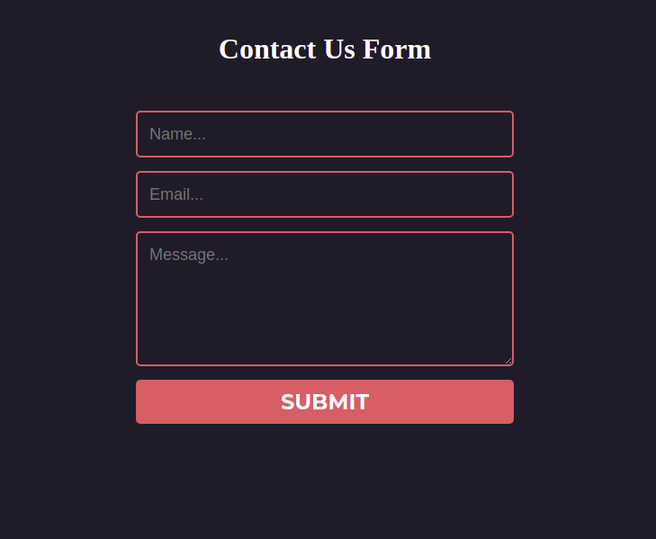

# Contact Us Package (for learning purpose)

This package send mail to admin and save contact us message

## Installation

Require via composer

```
$ composer require skrskr/contact
```

### if laravel version < laravel 5.5 
Add ContactServiceProvider to app.php
In `config/app.php` file

```php
'providers' => [
    ...
    SkrSkr\Contact\ContactServiceProvider::class,
    ...
];
```

## Runing
Migrate contact model migrations
```
$ php artisan migrate
```
Run development server
```
$ php artisan serve
```
Hit contact form url
```
http://localhost:8000/contact
```

## Customization
Run this command to generate the `contact.php` configuration file, `vendor/contact` folder for views  
```bash
$ php artisan vendor:publish    
```

Change admin mail in `contact.php`
```
"send_mail_to" => "admin@exmaple.com",
```

Customize contact us form in `vendor/contact/contact.blade.php` blade file.

Customize contact us mail style in `vendor/contact/contact/email.blade.php` blade file.

## Screenshot


